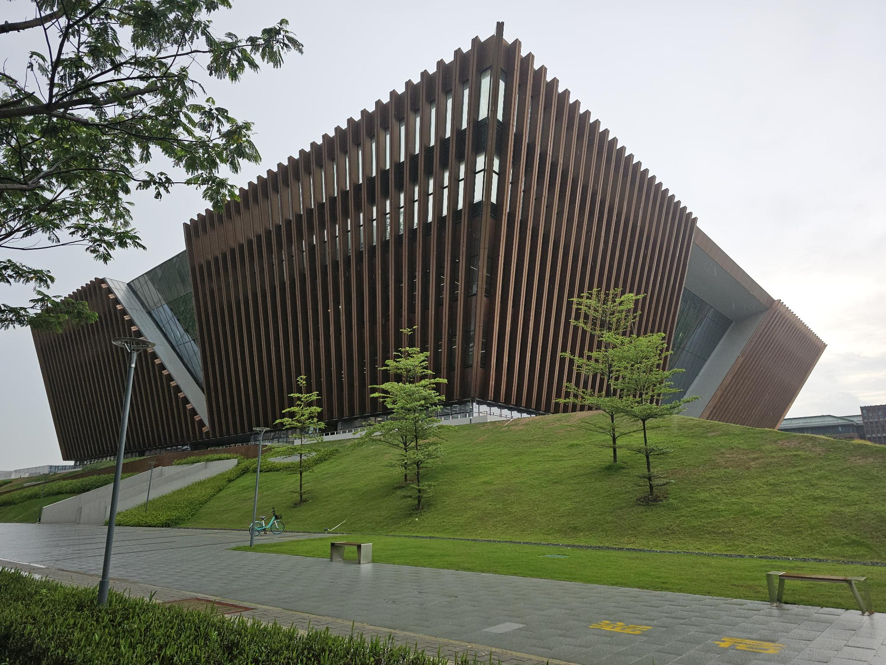
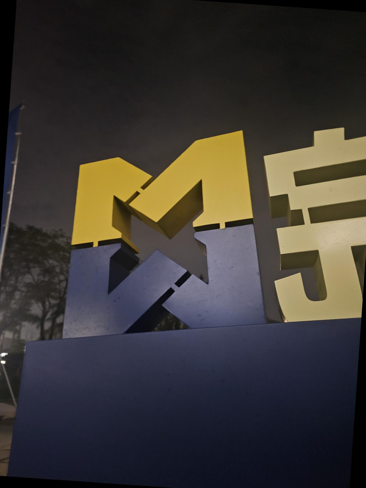
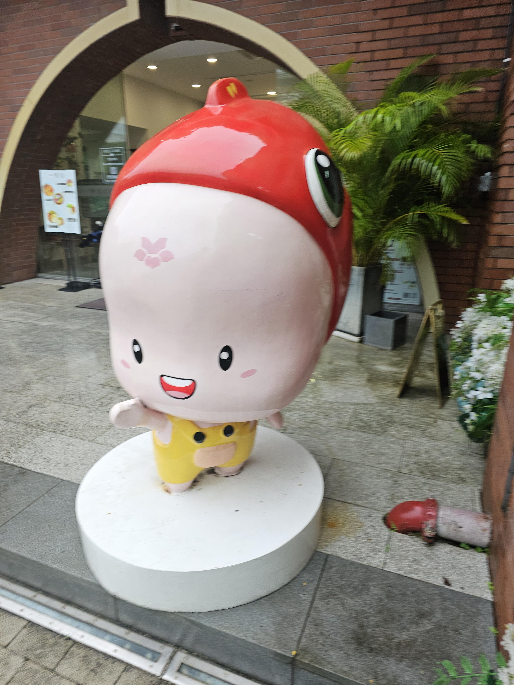
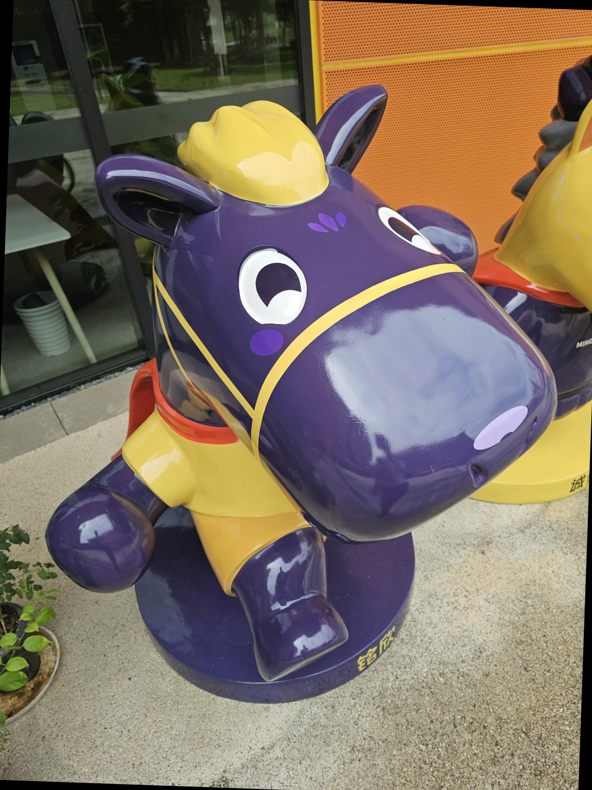
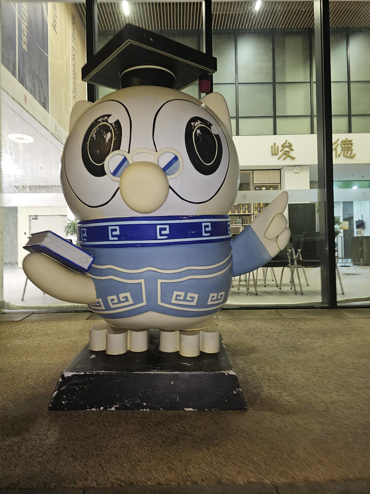

# ImageClassificationGZIC
ResNet50和ViT結合模型實現影像分類for華南理工大學廣州國際校區六類物品   

## Task
In this project, you are required to do a classification task on 6 types of objects related to Guangzhou International Campus, SCUT.  

| | | | | | |
|:----:|:---:|:----:|:----:|:---:|:----:|
|Bell tower|Library|School logo|Liyujun mascot|Mingcheng mascot|Junde mascot|

Use all the methods and tricks, including you learned in the lectures or from other resources, to train your own model with your own dataset.   

1. You should create your own dataset based on the examples. The examples of the test set are released and you should create your own dataset referring to the examples by taking photos or collecting images from the Internet. Do not use the released examples in the training!  
2. You should submit your model and test file to TA then obtain a test result. The test set will be kept by the TA in order to avoid possible cheating by directly training the model on the test set. You should submit a test  script with your model to TA then the TA cantest your result. The template of the test script is released with the data examples and you have 3 chances to submit the model. The data in the test set will be similar to the given examples and please validate your test script on the examples first.  
3. A project report within 5 pages and an oral presentation with slides should be completed.
   
總結：需要自己準備資料集後訓練模型，模型及代碼提交給TA獲取準確率結果，一共三次提交機會。
## Dataset
[Download](https://1drv.ms/u/c/585289ea0ef7a626/ETDIBRBdxuBBgQv6jCciBfcBI0CcsItDbxDitjKXL5GvTQ?e=t3P13T)

## 腳本說明
`train.py`：主訓練腳本  
`test_script.py`：提交給助教測試用的腳本模板  
`model_skeleton.py`：模型結構（ResNet50 + ViT）  
`sougou_scraper.py`：搜狗圖像爬蟲，幫忙蒐集資料

## Essay
[View](./Deep%20Learning%20Project%20on%20Image%20Classification%20for%20public.pdf)

## Slides
[View](./Deep%20Learning%20Project%20PowerPoint%20on%20Image%20Classification%20for%20public.pdf)

## Team Member Contribution
|Teammate|Individual Contributions|
|---|---|
|A|Took, collected and annotated approximately 300 images; Drafted  the  initial  Chinese  version  of  the  report,  created presentation slides and the speech script; Making 1 chart for Report; Presented the content using the slides.|
|B |Conducted preliminary literature review; Developed data preprocessing  scripts  (including  but  not  limited  to  data augmentation and background removal using masks) Built, selected   and   trained   models;   Designed   and   conducted experiments; Made 9 charts for Report; Assisted in refining the  report  and  presentation  slides;  Took  charge  of  the presentation and Q&A session.|
|C (repository maintainer)|Coded  a  Web  Scraper  for  Sogou;  Took,  collected  and annotated over 1600 photos; Translated, revised and added content to Report; Made 1 chart and 6 formulas for Report; Proofread and added content to PowerPoint; Edited and added content to speech script.|
